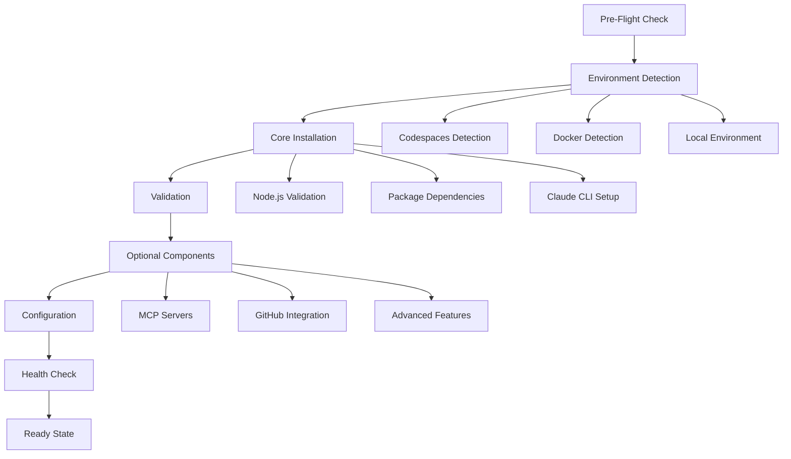

# HiveStudio Installation Architecture v2.0

## Architecture Overview

This document outlines the improved installation system incorporating Turbo Flow Claude best practices for streamlined, progressive, and resilient setup.

## Core Principles

### 1. Progressive Installation
- **Core First**: Essential components install first
- **Optional Later**: Advanced features installed on-demand
- **Graceful Degradation**: System works even if optional components fail

### 2. Environment Intelligence
- **Auto-Detection**: Identifies Codespaces, Docker, macOS, Linux
- **Adaptive Configuration**: Adjusts installation strategy per environment
- **Minimal Dependencies**: Reduces external requirements

### 3. Error Resilience
- **Retry Mechanisms**: Automatic retry with exponential backoff
- **Fallback Strategies**: Multiple installation paths
- **Clear Recovery**: Step-by-step error resolution

## Installation Phases



## Component Architecture

### Core Components (Required)
- Node.js runtime validation
- Essential dependencies (package.json)
- Basic project structure
- Minimal configuration

### Optional Components (Progressive)
- Claude CLI
- MCP servers (claude-flow, ruv-swarm, flow-nexus)
- GitHub integration
- Advanced orchestration features

## Implementation Strategy

### 1. Modular Design
```bash
install/
├── core/
│   ├── pre-flight.sh
│   ├── environment.sh
│   ├── dependencies.sh
│   └── structure.sh
├── optional/
│   ├── claude-cli.sh
│   ├── mcp-servers.sh
│   ├── github.sh
│   └── advanced.sh
├── utils/
│   ├── logger.sh
│   ├── retry.sh
│   ├── validate.sh
│   └── recover.sh
└── main-installer.sh
```

### 2. State Management
- Installation state tracking
- Checkpoint/resume functionality
- Component dependency mapping
- Health status monitoring

### 3. Configuration Templates
- Environment-specific configurations
- Progressive enhancement settings
- Fallback configurations
- Validation rules

## Error Handling Strategy

### 1. Graceful Degradation
```bash
# Example: Claude CLI installation failure
if ! install_claude_cli; then
    warn "Claude CLI installation failed"
    warn "System will work with reduced functionality"
    log "You can install Claude CLI later using: npm install -g @anthropic-ai/claude-code"
    continue_with_minimal_setup
fi
```

### 2. Retry Mechanisms
```bash
# Exponential backoff for network operations
retry_with_backoff() {
    local cmd="$1"
    local max_attempts=3
    local delay=1

    for i in $(seq 1 $max_attempts); do
        if eval "$cmd"; then
            return 0
        fi

        if [ $i -lt $max_attempts ]; then
            log "Attempt $i failed, retrying in ${delay}s..."
            sleep $delay
            delay=$((delay * 2))
        fi
    done

    return 1
}
```

### 3. Recovery Procedures
- Automatic rollback on critical failures
- Manual recovery instructions
- Diagnostic information collection
- Support contact guidance

## Environment-Specific Optimizations

### GitHub Codespaces
- No Homebrew dependency
- Optimized for remote development
- Pre-configured environment variables
- Fast startup optimizations

### Docker Containers
- Minimal system dependencies
- Container-optimized configurations
- Volume mount considerations
- Health check endpoints

### Local Development
- Platform-specific optimizations
- IDE integration setup
- Development tool configurations
- Performance optimizations

## Success Metrics

### Installation Success
- Time to first success: < 2 minutes
- Success rate: > 95%
- Error recovery rate: > 90%
- User satisfaction: Minimal intervention required

### System Health
- Component availability monitoring
- Performance baseline establishment
- Error rate tracking
- Usage analytics

## Future Enhancements

### 1. Interactive Installation
- Guided setup wizard
- Component selection interface
- Real-time progress tracking
- Intelligent recommendations

### 2. Cloud Integration
- Remote configuration management
- Team setup synchronization
- Enterprise deployment tools
- Centralized monitoring

### 3. AI-Powered Optimization
- Installation pattern analysis
- Predictive error prevention
- Personalized setup recommendations
- Automatic performance tuning